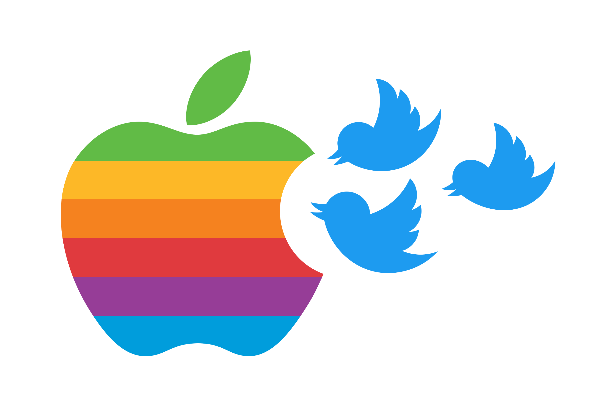

# Apple Brand Sentiment at SXSW

- Nick Gigliotti
- [ndgigliotti@gmail.com](ndgigliotti@gmail.com)

# Business Problem

Apple has asked me to create an accurate explanatory model for detecting positive and negative sentiment in tweets. They are primarily concerned with tweets about their company and products. My goals are:

1. Create an accurate explanatory classifier which classifies tweets as Positive or Negative.
2. Find out what people are saying about Apple and its products (at South by Southwest, 2011).
3. Make some PR recommendations for the period immediately following the event.

# Overview of Dataset

Since Apple is interested in sentiment analysis on Twitter, I've found a Twitter dataset with crowdsourced sentiment labels. It comes from [CrowdFlower](https://data.world/crowdflower), which has released other similar datasets.

The tweets are related to South by Southwest, an annual conference and arts festival in Austin, Texas. They are from 2011, when Apple launched the iPad 2.

It has only three features: the tweet text, the brand object of the sentiment, and the sentiment. It has only about 3,500 tweets after dropping the Neutral and Uncertain classes.

# Cleaning

I remove duplicates, but leave most of the retweets in the dataset.

Where there are tweets labeled with an emotion ('Positive' or 'Negative'), but no brand, I fill in the missing brand using regular expressions. I do not use the brands for modeling purposes, but only for analysis and interpretation.

I perform minimal text cleaning before BERT. I get rid of unreadable unicode symbols, decode HTML entities, and remove extra whitespace and newlines.

# Methods and Model

I finetune a highly accurate pre-trained BERT (deep neural network) after spending considerable effort on conventional models. The BERT was pre-trained on the Toronto Book Corpus and Wikipedia, then finetuned with one additional layer of neurons on this dataset. A multi-layer perceptron with 2 hidden layers is used as the classifier. The final model, whose confusion matrix is reproduced below, has an accuracy score of 93%.

 
The dataset is small and noisy, but I was nonetheless able to obtain an accurate model using transfer learning. My best conventional model achieves about 83% accuracy, 10% less than the finetuned BERT.

The models are optimized for macro average recall (i.e. the arithemtic mean of class recall scores) in order to compensate for the class imbalance. My final BERT attained an average recall of 0.89, which is about 0.08 higher than my best conventional model.

# Repository Structure

### Notebooks

There are two key notebooks in this repository: [main.ipynb](main.ipynb) and [exploratory.ipynb](exploratory.ipynb). The main notebook contains the initial data inspection, initial cleaning, and model development. The exploratory data analysis notebook contains (primarily) word clouds generated from TF\*IDF vectors. There is a positive and negative wordcloud for each human-labeled brand or product.

### Presentation

The slideshow presentation is located [here](/presentation) in the 'presentation' directory. You will also find PDF copies of the notebooks there.

### Sweeps

The [sweeps](sweeps) folder contains pickled `GridSearchCV` (and similar) objects in the form of `.joblib` files. There are many files which are no longer in use in the notebook. Nevertheless, this folder is very important because it contains the wealth of information gathered from each "parameter sweep" or "grid search".

### Images

The [images](images) folder is, naturally, the place for storing images used in the notebooks or presentation. I try to name the images as descriptively as possible.

## My [ndg-tools](https://github.com/ndgigliotti/ndg-tools) Package

I put a lot of time and energy into developing my own tools for analysis. It's probably my favorite part of this kind of work, and I (admittedly) tend to get carried away with it. I developed a lot in `ndg_tools.language`, `ndg_tools.sklearn.vectorizers`, and `ndg_tools.sklearn.selection` for this project in particular.

### Polymorphism

I've designed the raw-text processing functions in `ndg_tools.language` to be polymorphic: capable of handling both a single string document and various types of iterables of documents. This level of flexibility is arguably overkill for the present task. They also have optional parallel processing functionality, which is definitely overkill for the present task.

### FreqVectorizer

I extended Scikit-Learn's `TfidfVectorizer` to be capable of much more advanced preprocessing out of the box. In addition to the many new text filters, there's built-in stemming and lemmatization, better stopwords selection, and the option to mark negation.

### VaderVectorizer

Another notable development is the `VaderVectorizer`, which extracts VADER (Valence Aware Dictionary and Sentiment Reasoner) polarity scores from documents and turns them into short vectors of shape (n_samples, 4). This is essentially just a fancy wrapper around the VADER tools from NLTK, which integrates them with the Scikit-Learn API. It proved useful for the current project, up until I switched from conventional models to deep neural networks.

# Future Work

### Stacking Classifiers

After experimenting a little with Scikit-Learn's `StackingClassifier`, it's become clear that I could use it to develop a more accurate conventional model. The `StackingClassifier` trains several classifiers on the data and then trains a final classifier on the concatenated output of those classifiers. This is probably not worth pursuing, given the success of BERT.

### BERTweet

There is a pre-trained BERT variant known as BERTweet, trained specifically for English tweets. I suspect that I could achieve even higher accuracy with BERTweet, although it's probably not necessary.

