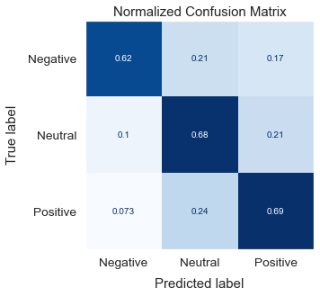
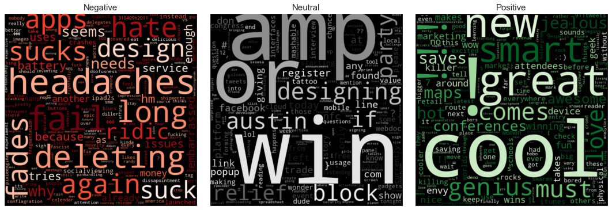
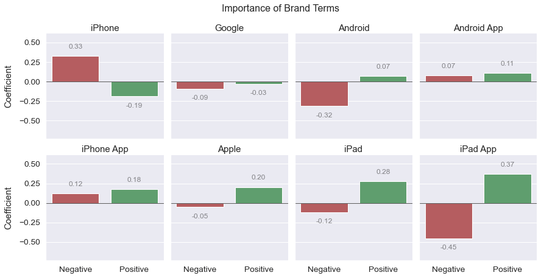
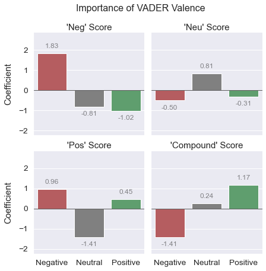

# Predicting Brand Sentiment on Twitter

- Nick Gigliotti
- [ndgigliotti@gmail.com](ndgigliotti@gmail.com)

# Business Problem

Apple has asked me to create a strong predictive model for detecting positive, negative, and neutral sentiment in tweets. They are primarily concerned with tweets about their company and products, but also might want to know what people are saying about competitors. They intend to use the model to classify new, never-before-seen, tweets, in order to conduct their research. My goals are:

1. Create an accurate classifier which can classify **novel tweets** as positive, negative, or neutral.
2. Find out what people are saying about Apple (at South by Southwest, 2011).
3. Make some recommendations based on my findings.

# Overview of Dataset

Since Apple is interested in sentiment analysis on Twitter, I've found a Twitter dataset with crowdsourced sentiment labels. It comes from [CrowdFlower](https://data.world/crowdflower), which has released other similar datasets.

The tweets are related to South by Southwest, an annual conference and arts festival in Austin, Texas. They are from 2011, when Apple launched the iPad 2.

It has only three features: the tweet text, the brand object of the sentiment, and the sentiment. It has only about 9,100 tweets.

# Cleaning

Where there are tweets labeled with an emotion ('Positive' or 'Negative'), but no brand, I fill in the brand using regular expressions. This is only about ~360 tweets. I use the (mostly) human-labeled brand-names for exploratory data analysis, but not for developing the model.

# Modeling

I develop a reasonably accurate logistic regression model after a tremendous amount of grid-searching and attention to minor details. The final model, whose confusion matrix is produced below, is not as accurate as I would like. Its accuracy is ~0.68, with a balanced accuracy of ~0.67.

 
The dataset is small and noisy, and I shouldn't expect to obtain a highly accurate model. Nevertheless, I have a good sense of how to improve it. See Future Work for more details.

## Methods

### TF\*IDF Words

I use Scikit-Learn's `TfidfVectorizer` to extract TF\*IDF keywords for each tweet in the corpus. The TF\*IDF features are the most important overall for prediction, but they are not the most useful for brand-related insights. See my EDA notebook ([exploratory.ipynb](exploratory.ipynb)) for a deeper brand-related examination of TF\*IDF keywords.

### Brand Terms
I extract brand terms based on the human-labeled brands using regular expressions. I encode their presence and absence in each tweet using `CountVectorizer(binary=True)`. They can be thought of like one-hot-encoded categorical variables. 

### VADER Polarity Scores

I augment my training data with VADER polarity scores (4-feature vectors). These scores are extracted dynamically during the modeling process using my `VaderVectorizer`. The features are 'Neg', 'Neu', 'Pos', and 'Compound'. Compound is expected to be the most important, as it's a composite of the other 3 scores plus some additional adjustments. For my model, Neg also proved very important.

# Repository Structure

### Notebooks

There are two key notebooks in this repository: [main.ipynb](main.ipynb) and [exploratory.ipynb](exploratory.ipynb). The main notebook contains the initial data inspection, initial cleaning, and model development. The exploratory data analysis notebook contains (primarily) word clouds generated from TF\*IDF vectors. There is a positive and negative wordcloud for each human-labeled brand or product.

### Presentation

The slideshow presentation is located [here](/presentation) in the 'presentation' directory. You will also find PDF copies of the notebooks there.

### My `tools` Package

I put a lot of time and energy into developing my own tools for analysis. I developed a lot in the `tools.language` module for this project in particular. The package is fairly extensive, and I don't aim to give a full description of it here. I will, however, mention a few highlights.

#### Caching

Some computationally expensive functions in `tools.language` implement caching, allowing them to save the results of previous calls and reuse them. This **dramatically increases their performance** when being called over and over again as part of a preprocessing pipeline. Essentially, after the function has been called once with certain parameters, every subsequent call with those parameters is fulfilled instantly. This is a highly non-trivial development, which increases the speed of parameter searches (e.g. with `GridSearchCV`) and makes model development more efficient in general.

#### Polymorphism

I've designed the text processing functions in `tools.language` to be polymorphic: capable of handling both a single string document and various types of iterables of documents. This level of flexibility is arguably overkill for the present task, but it allows the functions to be easily deployed within Scikit-Learn's `FunctionTransformer` (where they take array input) or as the `TfidfVectorizer.preprocessor` (where they take string input). They can also directly handle Pandas `Series` objects.

#### VaderVectorizer

Another notable development is the `VaderVectorizer`, which extracts VADER (Valence Aware Dictionary and Sentiment Reasoner) polarity scores from documents and turns them into short vectors of shape (n_samples, 4). This is essentially just a fancy wrapper around the VADER tools from NLTK, which integrates them with the Scikit-Learn API. Nevertheless, it proved very useful for the current project.

### Sweeps

The [sweeps](sweeps) folder contains pickled `GridSearchCV` (and similar) objects in the form of `.joblib` files. There are many files which are no longer in use in the notebook. Nevertheless, this folder is very important because it contains the wealth of information gathered from each "parameter sweep" or "grid search".

### Images

The [images](images) folder is, naturally, the place for storing images used in the notebooks or presentation. I try to name the images as descriptively as possible.

# Future Work
### Stacking Classifiers
After experimenting a little with Scikit-Learn's `StackingClassifier`, it's become clear that I could use it to develop a more accurate final model. The `StackingClassifier` trains several classifiers on the data and then trains a final classifier on the concatenated output of those classifiers. It also allows you to pass the training data to your final estimator, so the final estimator is trained both on prior data and the predictions of the classifier ensemble.

### Sophisticated Vectorization
I experimented some with Doc2Vec, a sophisticated unsupervised document vectorization algorithm, but didn't find it to offer any advantage over `TfidfVectorizer` when trained on this small dataset. It proved to be slower, much more complicated, and much less interpretable. However, if trained on a large corpus of tweets, and then used to predict vectors for the present dataset, it could prove to be better than TF\*IDF vectorization. Even if the Doc2Vec vectors didn't turn out to be better than the TF\*IDF vectors, they could potentially augment them. A Doc2Vec model trained on a large corpus would probably contribute **novel information**.

